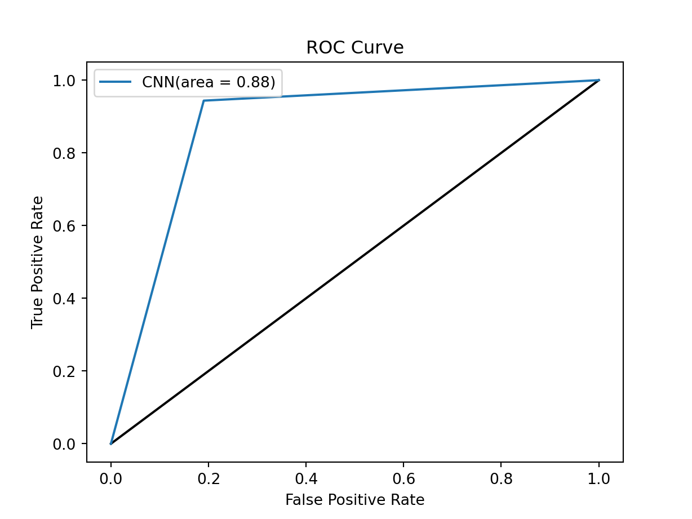

# **Detecting Prostate Cancer Using a Convolutional Neural Network with Transfer Learning**

### **Problem Statement** 
- Excluding skin cancer, prostate cancer, is the most common malignancy in men. Globally, around 1.1 million men are diagnosed with prostate cancer annually
- The standard method for diagnosis is transrectal ultrasonography guided biopsy (TRUS), but it has a high rate of incorrect results and is a painful procedure 
- Automated deep learning systems exhibit potential in accurately grading prostate cancer (PCa)
- The [Prostate cANcer graDe Assessment (PANDA) Challenge](https://www.kaggle.com/competitions/prostate-cancer-grade-assessment/overview) challenge took place on Kaggle in 2020, and featured over 1,000 teams competing for $25K in prizes 
- The training dataset includes around 11,000 whole-slide images of digitized H&E-stained biopsies from Radboud University Medical Center and Karolinska Institute
- This was the largest public whole-slide image dataset available, approximately eight times larger than the CAMELYON17 challenge
- For this project, the slide images in this data set will be used to build a CNN to diagnose prostate cancer

### **Data Dictionary** 
| Feature | Type | Dataset | Description |
| --- | --- | --- | --- |
| `image_id` | object | `train.csv` | ID code for the image. |
| `data_provider` | object | `train.csv` | The name of the institution that provided the data. Both the Karolinska Institute and Radboud University Medical Center contributed data. They used different scanners with slightly different maximum microscope resolutions and worked with different pathologists for labeling their images. |
| `isup_grade` | integer | `train.csv` | Train only. The target variable. The severity of the cancer on a 0-5 scale. |
| `gleason_score` | object | `train.csv` | Train only. An alternate cancer severity rating system with more levels than the ISUP scale.  |
| `image_name` | object | `validation_results.csv` | Name and associated file path of image from validation set.  |
| `model_pred` | binary | `validation_results.csv` | Label (cancer or noncancer) determined by the model. Cancer represented by 0, noncancer represented by 1.  |
| `actual_label` | binary | `validation_results.csv` | Actual label (cancer or noncancer). Cancer represented by 0, noncancer represented by 1. |

### **Data Overview & Preprocessing** 
- A total of 10,617 whole slide images and associated masks were analyzed, which made up a total of 383 GB of image
- A sample slide is shown below:  
 

 
- Each whole slide image had an accompanying cancer mask, which would indicate which regions of the slide where cancerous or benign
- Given the large size of each whole slide image (around 40 MB), the first step was to break the slide up into smaller tiles. 
- A function was created that broke the slide up into tiles of a specified size and returns the (x, y) pixel coordinates of the top left corner
- The function then summed the total number of pixels in the tile, and sorts from high to low (to filter out tiles with too much white space), and was then applied to extract the top 36 tiles of size 256x256 for each whole slide image. The figure below illustrates this process:  
 

 
- A function that determined if a tile is cancerous or benign based on the coordinates from its mask and associated Karolinska/Radboud label (2 for cancer in Karolinska and 3, 4, or 5 for Radboud) was then created. If at least one pixel in the associated region from the mask was cancerous, the tile was classified as cancerous
- This was done for each WSI, to create tiled images with the following naming convention: slide-name_tile-coordinate_label. Each tile was saved down in its respective folder
- 80% of the tiles were randomly selected as the training set, with the remaining 20% serving as the validation set 

### **Model Construction & Evaluation** 
- ResNet50 models are a popular choice in medical image analysis, particularly for detecting breast, skin or breast cancer, providing the most reliable performance for accuracy, sensitivity, and specificity. This model has been pre-trained on a large dataset, allowing it to learn intricate patterns and relevant features crucial for cancer detection
- A ResNet50 CNN mode was used as the pre-trained model for fine tuning for Transfer Learning, by replacing its last predicting layer with custom predicting layers
- The final version of the model ran for 15 epochs, and reached a maximum accuracy of 89%
- Below is the model's confusion matrix, showing the model had a specificity of 94% and sensitivity of 81%, and ROC Curve, showing an AUC of 0.88  
 
 
 

### **Model Inference & Conclusion** 
- This model can also be run on a whole slide image that overlays a cancer mask. This can be done through the creation of a function that breaks a slide into tiles, runs the model on each tile and then applies the mask (probability shaded).
- The tiles are then stitched together, with the output being the whole slide image with the cancer mask overlayed. An example of this is shown below, using the same slide image displayed previously:  
 

 
- Shading the regions of the slide with the highest probability of cancer can help save a pathologist time and improve their accuracy (especially sensitivity)
- This model can also be used by practing pathologists to help identify whether specific tissue samples are cancerous or not. Try it out [here](https://prostate-cancer-detector.streamlit.app)  
 
 
 
